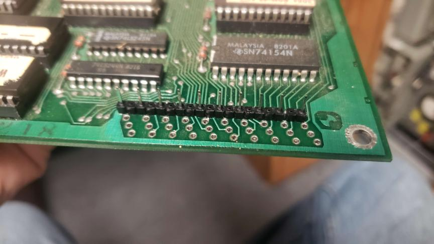

# Williams-ROM-Board-Ribbon-Cable-Adapter

This adapter sits on top of Williams ROM boards like those used in 
Defender, Stargate, Bubbles, Sinistar, Joust, etc.

It changes the uncommon style of ribbon cable used on these boards to
a very common 40 (20x2) pin 0.1" pitch IDC cable. Very similar to standard IDE.

These ribbon cables go bad often due to repeated plugging / unplugging
and tugging on the cable, combined with the awkward design of the 
original connector. So instead of shelling out $10 for a new connector
with the same design, I just made this which should hold up better,
and if the cable ever gets flakey, it's much easier to replace it!

**BILL OF MATERIALS** :

**1 x 20x2 pin IDC Connector (2.54mm pitch)**\
&nbsp;&nbsp;&nbsp;&nbsp; DGK: 	S9175-ND\
**4 x 20x1 Pin Headers (2.54mm pitch)**\
&nbsp;&nbsp;&nbsp;&nbsp; DGK: 	2057-PH1-20-UA-ND\
**1 x 20x2 6" Ribbon Cable (2.54mm pitch)**\
&nbsp;&nbsp;&nbsp;&nbsp; DGK: 	H3CCS-4006G\

**TESTING STATUS:**

Installed a few in some late Defender rom boards, and they work!
In theory most williams ROM boards (up to mystic marathon or
something) use this connector, so they should work.
(There is a possiblity for clearance issues as I've not tried 
every revision)

**INSTALLATION INSTRUCTIONS:**

First, remove the old connector by desoldering it from the
ROM board.

Originally I had assembled this by cutting up individual pins
and placing them in the holes. BUT as it turns out there's a 
much easier way to assemble this. 
First, solder the Ribbon Cable Header onto the little PCB.
Then, you'll need 4 strips of 20 0.1" pitch pins. Remove every other pin.
Insert into board as shown in the picture.

Then lay my PCB on top (lining up the pins) and top solder the pins
to the board.

You could also try just resting the PCBs and foregoing the pins, but
I haven't tried it and I feel like it's more susceptible to breaking
off. (But if you do, tell me how it goes!)

