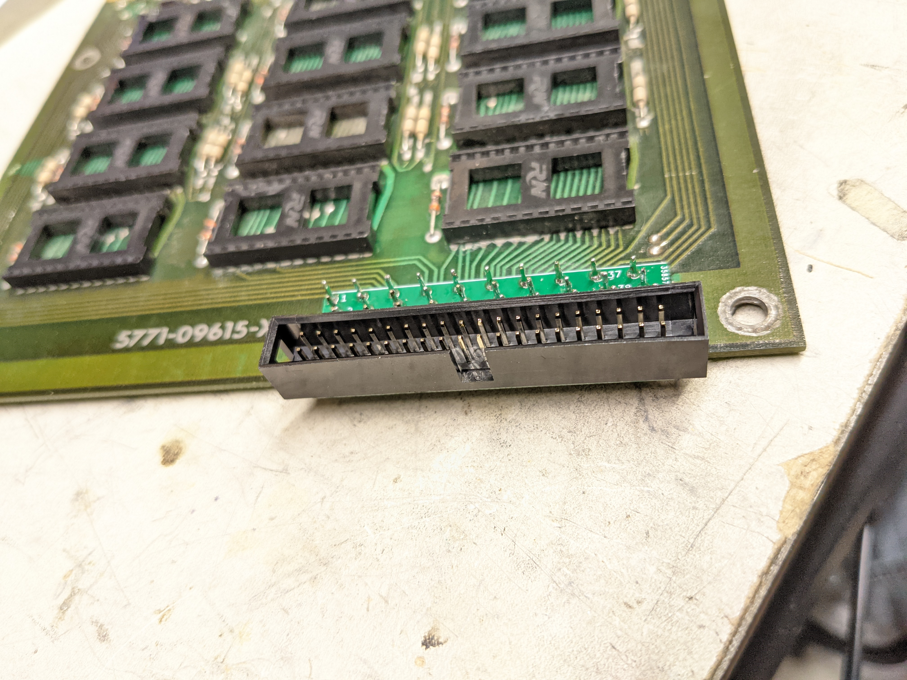
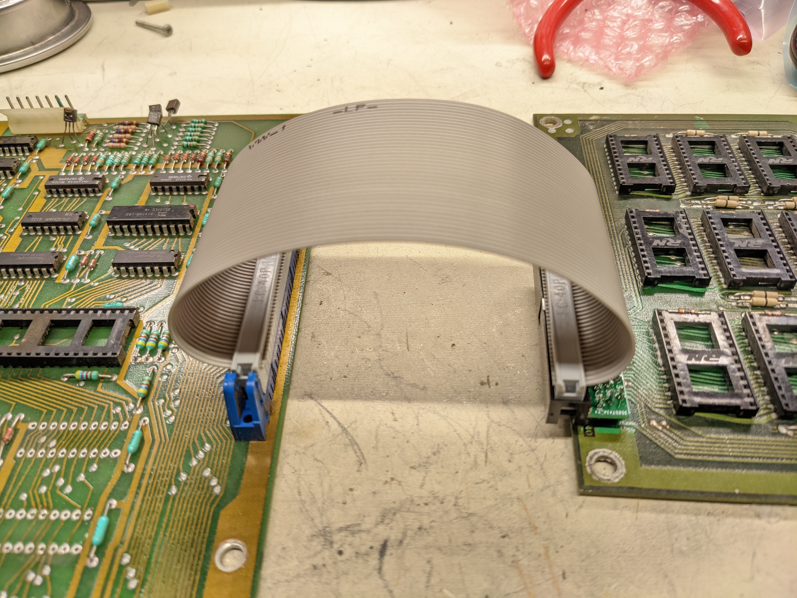

# Williams-ROM-Board-Ribbon-Cable-Adapter

This adapter sits on top of Williams ROM boards like those used in 
Defender, Stargate, Bubbles, Sinistar, Joust, etc.

It changes the uncommon style of ribbon cable used on these boards to
a very common 40 (20x2) pin 0.1" pitch IDC cable. Very similar to standard IDE.

These ribbon cables go bad often due to repeated plugging / unplugging
and tugging on the cable, combined with the awkward design of the 
original connector. So instead of shelling out $10 for a new connector
with the same design, I just made this which should hold up better,
and if the cable ever gets flakey, it's much easier to replace it!

**BILL OF MATERIALS** :\

**40 x 1 Pin Header (2.54mm pitch)**\
&nbsp;&nbsp;&nbsp;&nbsp; DGK:
**1 x 40 pin IDC connector (2.54mm pitch, 2x20 pins)**\
&nbsp;&nbsp;&nbsp;&nbsp; DGK:

**TESTING STATUS:**

Installed a few in some late Defender rom boards, and they work!
In theory most williams ROM boards up to mystic marathon or
some game around that time use this connector, so they should work.
There is always a possiblity for clearance issues.

**INSTALLATION INSTRUCTIONS:**

First, remove the old connector by desoldering it from the
ROM board.

There's probably easier ways to assmeble this... but I cut up 
10 pin strips of those pin hehaders, and placed a pin in each
of the pin holes in the ROM board, so that the plastic was on
the top side of the ROM board. Then, I took a PCB, placed it
on top and got all the pins to line up. And then it was just 
a matter of soldering all the pins.

A friend suggested that I don't even need the pins, just to
have the boards touching and fill the holes with solder.
You are certainly welcome to try this, and if you do, let me
know how that goes!

